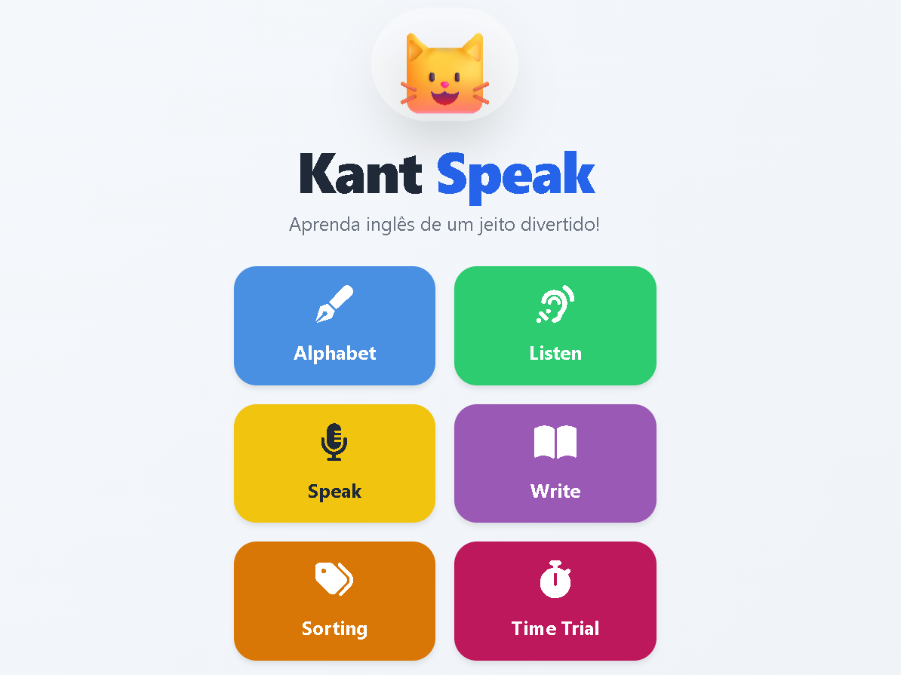

# Summary

KantSpeak is an open‑source experimental framework designed for research in adaptive learning systems and human–computer interaction (HCI). The framework enables reproducible experiments on adaptive task selection using behavioral metrics such as accuracy and response time in multimodal learning environments. Unlike conventional educational applications, KantSpeak is built as a research infrastructure that integrates experimental control, adaptive decision‑making, structured logging, and offline statistical analysis.

# Statement of Need

Research in adaptive learning systems requires reproducible and configurable environments to evaluate how users respond to different adaptation strategies. Existing educational tools typically implement proprietary or non‑transparent adaptation mechanisms, limiting reproducibility and experimental control. Moreover, many systems lack structured data pipelines suitable for scientific analysis.

KantSpeak addresses these limitations by providing a modular framework that supports:
- controlled experimental design;
- configurable adaptive policies;
- structured behavioral data logging;
- reproducible offline analysis.

This enables systematic evaluation of adaptive learning strategies under controlled conditions.

# System Architecture

KantSpeak is composed of five core components.

## 1. Logger
The Logger records all user interactions during experimental sessions, including timestamps, event types, user responses, correctness, and response time. All data are stored in structured JSON format.

## 2. ExperimentManager
The ExperimentManager controls experimental execution by assigning participants to experimental groups, defining experimental conditions, managing session flow, and aggregating performance metrics.

## 3. AdaptiveEngine
The AdaptiveEngine implements adaptive decision‑making strategies for task selection. Supported approaches include contextual multi‑armed bandits (e.g., Thompson sampling) and fuzzy rule‑based adaptation models.

## 4. Instrument API
HTTP endpoints connect the front end with the experimental back end:
- `/instrument.php` receives and stores interaction logs;
- `/adapt.php` returns the next selected task based on the adaptive policy.

## 5. Researcher Dashboard
A web‑based interface for data exploration and analysis, including session‑level inspection, aggregated metrics per experimental group, export of structured logs, and comparison between conditions.

# Adaptive Mechanism (Thompson Sampling)

The adaptive system computes a performance score based on accuracy of responses and response time. This score is used by the AdaptiveEngine to update task‑selection policies using probabilistic bandit‑based methods. For each activity \(a\), the system maintains a Beta distribution \(\text{Beta}(\alpha_a, \beta_a)\) where \(\alpha_a = \text{success}_a + 1\) and \(\beta_a = \text{failure}_a + 1\). At each decision point, a sample \(\theta_a\) is drawn from each distribution using the Johnk method, and the activity with the highest \(\theta_a\) is selected. This balances exploration and exploitation while incorporating prior information (e.g., child's age, support level). All parameters are configurable to support reproducible experimental designs.

# Data Collection and Reproducibility

KantSpeak ensures reproducibility through:
- structured JSON logging of all interactions;
- configurable experimental parameters (stored in `data/experiments/active.json`);
- separation between user interface, experimental logic, and analysis layers;
- exportable datasets for offline evaluation.

# Offline Analysis

The framework includes Python‑based tools for:
- descriptive statistics;
- hypothesis testing (t‑test, ANOVA);
- learning curve visualization;
- comparison between experimental groups.

# Software Design

KantSpeak is implemented using standard web technologies:
- HTML, CSS, JavaScript (front end);
- PHP (API layer);
- Python (analysis pipeline).

No proprietary dependencies are required, ensuring accessibility and reproducibility. The software is released under the MIT license and is available on GitHub.

# Figures

# AI Usage Disclosure

AI‑based tools were used to generate visual assets for specific interface components. All generated content was reviewed and validated by the authors before integration into the system.

# References
